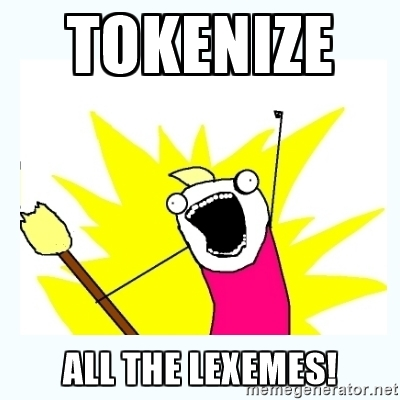

slidenumbers: True

# Learn Parsing Theory with pyparsing

---

# Goal of parsing:

Arrange input data in a memory layout which is suitable for further computation and processing.

---

## World's most famous parser: Web browser

- Parses HTML and determines appropriate bit colors on screen.

---

# Lexing and Parsing

- Lexing: Assigning meaning to words
- Parsing: Assigning meaning to sentences

---

# Lexing and Parsing

- A lexer cannot tell you that 'Run Spot see' is not a valid sentence; a parser is required
- A lexer *can* tell you that 'Run', 'Spot', and 'see' are all valid English words

---

# Lexemes


Lexemes are the basic 'words' of your text, before they are ascribed a meaning or placed in a category.

---

# Lexemes

The lexemes of the C statement

```c
double x = 3.14;
```

are `double`, `x` , `=`, `3.14`, and `;`.


---

# Tokenization

Once we ascribe a category to the lexeme, it becomes a token.

So

```python
('double', 'primitive type'),
('x', 'identifier'),
('=', 'assignment'),
('3.14', 'float literal'),
(';', 'end of statement')
```

constitute a *tokenization* of the C statement.

---

# Backus-Naur Form

We wish to clarify our thoughts about parsing our grammar by first writing a description of the problem.

We use Backus-Naur form to achieve this.

---

# Backus-Naur Form

A way of describing a grammar.


---

# Backus-Naur Form

```
<C statement> ::= <type> + <identifier> + <assignment> + <value> + <end of statement>
<type> ::= 'float'|'double'|'long double'
<identifier> ::= Alphanumeric
<assignment> ::= '='
<value> ::= <identifier>|<number>
<end of statement> ::= ';'
```

The components of "C statement" must occur in order.

---

# pyparsing

Let's see if we can get the python pyparsing module to parse our C statement:

```bash
$ pip3 install pyparsing
```

---

## Example 1: Parse a C assignment statement

```python
from pyparsing import Word, Literal, alphas, alphanums, nums, oneOf
type = oneOf(["float", "double", "long double"])
identifier=Word(alphas, alphanums+'_')
assignment=Literal("=")
number=Word(nums+".")
eos=Literal(";")
cstatement=type + identifier + assignment \
... + (number|identifier) + eos
cstatement.parseString('double x = 7;')
# (['double', 'x', '=', '7', ';'], {})
cstatement.parseString('double y = x;')
# (['double', 'y', '=', 'x', ';'], {})
```

---

## Aside: When should I use Pyparsing?

Pyparsing is a single-file, MIT licensed parser with no dependencies; I am aware of no competitors. However, if your data format is well known, then there are format-specific parsers that already exist:

- `BeautifulSoap` for HTML
- `xlrd` for Excel
- `pdfminer` for pdfs
- `import json` for JSON

---

# pyparsing

Note: We're not even close to a full-fledged C parser; for instance

```c
double x=7, y=3;
```

is valid C, but our parser chokes:

```python
>>> cstatement.parseString('double x=7, y=3;')
...
pyparsing.ParseException: Expected ";" (at char 10), (line:1, col:11)
```

---



---

## Tokenize the lexemes via `setResultsName`:

```python
>>> cstatement=type.setResultsName("type") \
... + identifier.setResultsName("new_identifier") \
... + assignment \
... + (number|identifier).setResultsName("rhs") + eos
>>> out = cstatement.parseString("double x = 7;")
>>> out.type
'double'
>>> out.rhs
'7'
```


---

Once you've parsed a statement, you might not care about certain tokens such as '`;`'' or '`=`'.

So you can ignore them with the following syntax:

```python
>>> from pyparsing import Suppress
>>> assignment = Suppress(Literal("="))
>>> eos = Suppress(Literal(";"))
>>> cstatement=reserved + identifier + assignment + (number|identifier) + eos
>>> keyword, id, rhs = cstatement.parseString("double x = 7;")
>>> keyword
'double'
>>> id
'x'
>>> rhs
'7'
```

---

# Now let's step up our game:

```c
char* c = "He said \"hello friend!\"";
```

The lexemes are

1. `char*`

1. `c`

1. `=`

1. `"He said \"hello friend!\"";`


---

# Backus-Naur form for C-strings

C string definition ::= type specifier + identifier + assignment + (identifier|string)


---

# Pain in parsing strings: Escape characters.

```c
char* s="he said \"hello friend!\"";
```

We can't just match double quotes; we need an escape string.

---

# pyparsing C string definitions

```python
>>> type_specifier = Literal("char*")
>>> identifier = Word(alphas, alphanums+"_")
>>> assignment = Suppress(Literal("="))
>>> string = QuotedString('"', escChar='\\')
>>> eos = Suppress(Literal(";"))
>>> cstringdef = type_specifier + identifier + assignment + string + eos
>>> s = r'''char* s="he said \"hello friend!\"";'''
>>> keyword, id, string = cstringdef.parseString(s)
>>> keyword
'char*'
>>> id
's'
>>> string
'he said "hello friend!"'
```

---

## pyparsing: Defining parse actions

While parsing

```c
double pi = 3.14;
```

we really need to represent `pi` as IEEE 64 bit in memory, not just the string `3.14`.

This can be achieved via parse actions, which are simply callbacks.

---

## pyparsing: Defining parse actions

```python
number = Word(nums+".").setParseAction(lambda t:float(t[0]))
...
cstatement=reserved + identifier + assignment + number + eos
keyword, id, rhs = cstatement.parseString("double pi = 3.14;")
print(rhs)
# 3.14
```


---

## pyparsing: A bit too forgiving?

If `double x = 3.14;` parses, then

```c
double x = 3.14; &\;random&\;syntactically&\;incorrect&\;garbage
```

will also parse.

---

## pyparsing: `stringEnd`

Use `stringEnd` to make sure that strings don't have random garbage at the end:

```python
from pyparsing import stringEnd
...
# Will throw exception:
parse_result = (cstatement + stringEnd).parseString("double x = 3.14; random garbage")
```

---

# How to write a forgiving parser: Advice

1. Get a big pile of test data
1. Pass 1: Remove all the comments, strip all whitespace from line end/beginning
1. Pass 2: Group data, don't parse it, (e.g., group in `<head>` and `<body>` before a full parse)
1. Pass 3: Parse groups individually.


---

# How to write a forgiving parser: Advice

1. Attempt to parse each group multiple ways (e.g., `parseString(line)` and `line.split()`)
1. Pass a logger to your parser, if you can't parse, log, don't fail
1. Most data you parse is irrelevant; don't get hung up on special cases unless you actually need them

---

# pyparsing: Hacking on unstructured data

Let's try to parse:

`'C' C 'He3' C14`

The lexemes are easy enough to identify for a human, let's see what the computer thinks.

---

```python
>>> from pyparsing import *
>>> s = r''' 'C' C 'He3' C14 '''
>>> lexeme_gen = OneOrMore(Word(alphas, alphanums) | QuotedString("'", escChar="\\"))
>>> lexeme_gen.parseString(s)
(['C', 'C', 'He3', 'C14'], {})
```

----

```python
>>> s = r''' 'C' C 'He3' C14 Sn2+ '''
>>> lexeme_gen = OneOrMore(Word(alphas, alphanums+"+") | QuotedString("'", escChar="\\"))
>>> lexeme_gen.parseString(s)
(['C', 'C', 'He3', 'C14', 'Sn2+'], {})
```

---

```python
>>> s = r''' 'C' C 'He3' C14 Sn2+ 732 '''
>>> lexeme_gen = OneOrMore(Word(alphas, alphanums+"+") | QuotedString("'", escChar="\\") | Word(nums))
>>> lexeme_gen.parseString(s)
(['C', 'C', 'He3', 'C14', 'Sn2+', '732'], {})
```

---

```python
>>> s = r''' 'C' C 'He3' C14 Sn2+ 732 0.732 '''
>>> lexeme_gen = OneOrMore(Word(alphas, alphanums+"+") | QuotedString("'", escChar="\\") | Word(nums+"."))
>>> lexeme_gen.parseString(s)
(['C', 'C', 'He3', 'C14', 'Sn2+', '732'], {})
```

---

```python
>>> s = r''' 'C' C 'He3' C14 Sn2+ 732 0.732 -0.32 '''
>>> lexeme_gen = OneOrMore(Word(alphas, alphanums+"+") | QuotedString("'", escChar="\\") | Word(nums+"."+"-"))
>>> lexeme_gen.parseString(s)
(['C', 'C', 'He3', 'C14', 'Sn2+', '732', '0.732', '-0.32'], {})
```

---

```python
>>> s = r''' 'C' C 'He3' C14 Sn2+ 732 0.732 -0.32 4.6(3)'''
>>> lexeme_gen = OneOrMore(Word(alphas, alphanums+"+") | QuotedString("'", escChar="\\") | Word(nums+"."+"-"+"("+")"))
>>> lexeme_gen.parseString(s)
(['C', 'C', 'He3', 'C14', 'Sn2+', '732'], {})
```

---

## What do we do with malformed input data?

- If you are a C compiler, give the user an inscrutable error message.
- If you are a web brower, be forgiving, do your best to render what you've got.

---

## Why should browsers be forgiving parsers?

- Users will try to open the page in a different browser if your browser doesn't render it.

---

## Writing a forgiving parser is hard

> The death spiral of frustration that is so common when you have to write parsers is not easy to avoid.
-- Paul McGuire, author of PyParsing

---

# Forgiving Parsers Become Insane

Is there an alternative?


---

## Alternative to a Parser: Memcopy your data structure to disk

This is called *blitting*, or serialization, but there are [tradeoffs](https://www.joelonsoftware.com/2008/02/19/why-are-the-microsoft-office-file-formats-so-complicated-and-some-workarounds/).

---

## Blitting/Serialization

- Fast, but not portable. (Ever opened a binary file you couldn't interpret? Ever read data with incorrect endianness?)
- Line between serialization and parser isn't clear (e.g., HDF5: Binary data segments organized into a B-tree)

---
